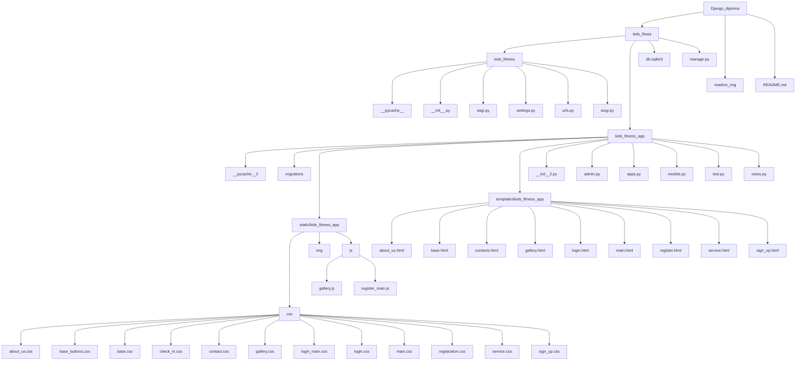

# Дитяча фітнес студія Kids Fitness
#### Сайт створенний для швидкого та простого запису на заняття до дитячої фітнесс студії
.png)
# Зміст
#### [Учасники команди / team members](#title1)
#### [Переваги](#title5)
#### [Технології / Technologie](#title2)
#### [Використання / launch of the project](#title3)
#### [Структура](#title7)
#### [Основні Функції / main functions](#title4)


## <a id="title1">Учасники команди / team members</a>
- Ярослав Теліус / Yaroslav Telius - Team lead 
>- [Github](https://github.com/TeliusYaroslav "Github")
>- [Figma](https://www.figma.com/design/B4FPYXDBsxMPMCjVxroGOU/Untitled?node-id=0-1&t=M1SHABTPBk7JIkpU-0 "Figma")
>- [Figjam](https://www.figma.com/board/SdWArB2QfOjYUKFSFBrJoM/Untitled?node-id=0-1&t=RFILsCbM5wzPIvhM-0 "Figjam")

- Ярослав Пройдисвіт / Yaroslav Proidysvit 
>- [Github](https://github.com/geniyhub "Github")
>- [Figma](https://www.figma.com/design/B4FPYXDBsxMPMCjVxroGOU/Untitled?node-id=0-1&t=szvfV9d10XQNp5V6-1 "Figma")
>- [Figjam](https://www.figma.com/board/SdWArB2QfOjYUKFSFBrJoM/Untitled?node-id=0-1&t=SHinTeKmjVd3m2uz-1 "Figjam")

- Іван Кратенко / Ivan Kratenko 
>- [Github](https://github.com/ruopodfg "Github")
>- [Figma](https://www.figma.com/design/B4FPYXDBsxMPMCjVxroGOU/Untitled?node-id=0-1&t=9pMWxwRTPLGG3xZW-1 "Figma")
>- [Figjam](https://www.figma.com/board/SdWArB2QfOjYUKFSFBrJoM/Untitled?node-id=0-1&t=ok4nPbWmv5KGHww2-1 "Figjam")

- Ілля Булкін / Ilia Bulkin
>- [Github](https://github.com/IliaBulkin "Github")
>- [Figma](https://www.figma.com/design/6w1t0BhnualqM0xpowc2F7/Untitled-(Copy)?t=J5kjRN5uvvqwk8qT-1 "Figma")
>- [Figjam](https://www.figma.com/board/dbu0I6zzVvfbtMzvg6TiIE/Untitled-(Copy)?node-id=7-361&t=chMWSF2sfJdf2S2m-1 "Figjam")

- Діана Панасенко /Panasenko Diana
>- [Github](https://github.com/PanasenkoDiana "Github")
> - [Figma](https://www.figma.com/design/B4FPYXDBsxMPMCjVxroGOU/Untitled?t=Xzdp1BLUnI5nLwLm-0 "Figma")
> - [Figjam](https://www.figma.com/board/SdWArB2QfOjYUKFSFBrJoM/Untitled?node-id=0-1&t=Y9qskt3i5QIP55ed-0 "Figjam")

## <a id="title5">Переваги </a>

### Наш проєкт в першу чергу це зручна платформа для простого та швидкого запису дітей у дитячий фітнес центр. Для нас як для розробників цей проєкт це серйозна практика щодо створення повноцінного сайту для замовника


## <a id="title2">Технології / Technologies</a>
- **Html**
- **JavaScript**
- **Css**
- **Python Django** 
- **SQlite3**
- **MySQL**
- **Bootstrap 5**
- **ChatGpt 3**
- **ajax**
- **jquery**
- **Git**

## <a id="title3">Структура</a>


## <a id="title3">Використання / launch of the project</a>
## 1.Встановити додатки 
- Python django використовуємий у проєкті фреймворк 
Відкрийте консоль у вашому редакторі кода та впишіть команду 
> **```pip install django```**    
- Далі перевірте чи встановился фреймворк
>**```django-admin --version```**
- Також проєкт використовує такі стандартні мови як HTML,CSS,JS Які встановлювати не потрібно
## 2. Запуск проєкту(локально)
- Клонуємо проєкт з github-у використовуючи команду 
> **```git clone https://github.com/TeliusYaroslav/Django_diploma.git```**
- Далі переходимо до рабочої дерикторії використовуючи команду
> **cd kids_fitness**
- Запускаємо локальний сервер використовуючи команду
> **python manage.py runserver**

## 3.Запуск проєкту(віддалено)
- Копіюємо посилання на проєкт на платформі  Github у консоль пишемо
>**```git clone https://github.com/TeliusYaroslav/Django_diploma.git```**

- Потім створюємо віртуальне серидовище
>**mkvirtualenv назва віртуального серидовища**

- Потім переходимо до папки у якій знаходится сам проєкт за допомогою **ls** та **cd**. **ls** використовуємо для перегляду у який папці ми знаходимося, а **cd** для переходу до потрібної папки копіюємо шлях та вставляємо його як шлях до нашого проєкту у **wsgi configuration** також вказуємо шлях до **settings.py** у цьому-ж файлі

- Тепер створюємо веб додаток, у вибірі фреймворку обираємо Django, 
>**версію python обираємо 3.10**

- У **Virtualenv** на сайті вказуємо шлях до нашого віртуального серидовища 
>**/home/user/.virtuaenvs/назва віртуального простору**

- у **settings.py** знаходимо строку **Allowed_Hosts []** та вписуємо туди посилання на нашу сторінку вказану у **web tab** на сайті

- повертаємося до консолі, у консолі пишемо команду **python manage.py collectstatic**

- У url прописуємо шлях до папок **static** та **media** які ми зібрали командою 

# <a id="title7">Структура</a>


## <a id="title4">Основні Функції / main functions</a>
#### views.py
- **Функція відправлення запису на заняття**
```python
# Визначаємо функцію submit_registration, яка приймає HTTP-запит як аргумент
def submit_registration(request):
    # Перевіряємо, чи метод запиту є POST
    if request.method == 'POST':
        # Отримуємо повне ім'я з POST-даних
        full_name = request.POST.get('full_name')
        # Отримуємо номер телефону з POST-даних
        phone_number = request.POST.get('phone_number')
        # Отримуємо вік дитини з POST-даних
        child_age = request.POST.get('child_age')
        # Отримуємо дату тренування з POST-даних
        training_date = request.POST.get('training_date')
        # Отримуємо email з POST-даних
        email = request.POST.get('email')
        # Тема електронного листа
        subject = 'Новий запис на заняття'
        # Тіло електронного листа
        message = f'Ім`я: {full_name}\nНомер телефону: {phone_number}\nВік дитини: {child_age}\nДата тренування: {training_date}\nEmail: {email}'
        from_email = settings.EMAIL_HOST_USER  # Вказуємо електронну адресу відправника
        to_email = [settings.EMAIL_HOST_USER]  # Вказуємо електронну адресу одержувача
        # Пробуємо виконати наступний код
        try:
            # Створюємо об'єкт EmailMessage
            email = EmailMessage(subject, message, from_email, to_email) 
            # Відправляємо електронний лист
            email.send()
            # Відображаємо сторінку реєстрації
            return render(request, 'kids_fitness_app/sign_up.html')
        # Обробляємо виключення, якщо виникла помилка
        except Exception as e:  
            # Повертаємо повідомлення про помилку
            return HttpResponse("Помилка, спробуйте знову.", status=500)  
    # Якщо метод запиту не POST
    else: 
        # Повертаємо повідомлення про недозволений метод 
        return HttpResponse("Метод не дозволен", status=405)
```

- **Функція відображення головної сторінки**
```python
def main(request):
    return render(request, 'kids_fitness_app/main.html')
```
- **Функція відображення сторінки послуг**
```python
def service(request):
    return render(request, 'kids_fitness_app/service.html')
```
- **Функція відображення сторінки запису**
```python
def sign_up(request):
    return render(request, 'kids_fitness_app/sign_up.html')
```
- **Функція відображення сторінки з інформацією про фітнес-клуб**
```python
def about_us(request):
    return render(request, 'kids_fitness_app/about_us.html')
```
- **Функція відображення галереї**
```python
def gallery(request):
    return render(request, 'kids_fitness_app/gallery.html')
```
- **Функція відображення контактів**
```python
def contacts(request):
    return render(request, 'kids_fitness_app/contacts.html')
```
- **Функція відображення сторінки реєстрації та логіка роботи**
```python
# Визначаємо функцію register, яка приймає HTTP-запит як аргумент
def register(request): 
    # Перевіряємо, чи метод запиту є POST
    if request.method == 'POST':  
        # Отримуємо email з POST-даних
        email = request.POST.get('email')
        # Отримуємо пароль з POST-даних
        password = request.POST.get('password')
        # Отримуємо підтвердження пароля з POST-даних
        password_confirm = request.POST.get('password_confirm')
        # Отримуємо ім'я користувача з POST-даних
        username = request.POST.get('username')
        # Перевіряємо, чи паролі співпадають
        if password != password_confirm:
            # Виводимо повідомлення про помилку
            messages.error(request, 'Паролі не співпадають')
            # Перенаправляємо користувача на сторінку реєстрації
            return redirect('register')
        # Перевіряємо, чи існує користувач з таким email
        if User.objects.filter(email=email).exists():
            # Виводимо повідомлення про помилку
            messages.error(request, 'Користувач із таким email вже існує')
            # Перенаправляємо користувача на сторінку реєстрації
            return redirect('register')
        # Перевіряємо, чи існує користувач з таким ім'ям
        if User.objects.filter(username=username).exists():
            # Виводимо повідомлення про помилку
            messages.error(request, 'Користувач із таким імям вже існує')
            # Перенаправляємо користувача на сторінку реєстрації
            return redirect('register')
        # Створюємо нового користувача    
        user = User.objects.create_user(username=username, email=email, password=password)
        # Зберігаємо користувача в базі даних
        user.save()
        # Виконуємо вхід користувача в систему
        login(request, user)
        # Виводимо повідомлення про успішну реєстрацію
        messages.success(request, 'Ви успішно зареєстровані та увійшли до системи!')
        # Перенаправляємо користувача на головну сторінку
        return redirect('main')
    # Відображаємо сторінку реєстрації    
    return render(request, 'kids_fitness_app/register.html')

```
- **Функція відображення логіну та логіка роботи**
```python
# Визначаємо функцію user_login, яка приймає HTTP-запит як аргумент
def user_login(request):
    # Перевіряємо, чи метод запиту є POST
    if request.method == 'POST':
        # Отримуємо ім'я користувача з POST-даних
        username = request.POST.get('username')
        # Отримуємо пароль з POST-даних
        password = request.POST.get('password')
        # Аутентифікуємо користувача
        user = authenticate(request, username=username, password=password)
        # Перевіряємо, чи користувач існує
        if user is not None:
            # Виконуємо вхід користувача в систему 
            login(request, user)
            # Виводимо повідомлення про успішний вхід
            messages.success(request, 'Ви успішно увійшли до системи!')
            # Перенаправляємо користувача на головну сторінку
            return redirect('main')
        # Якщо користувач не знайдений    
        else:
            # Виводимо повідомлення про помилку
            messages.error(request, 'Неправильне імя користувача або пароль')
    # Відображаємо сторінку входу        
    return render(request, 'kids_fitness_app/login.html')
```
- **Функція вихіду з аккаунту**
```python
    # Визначаємо функцію user_logout, яка приймає HTTP-запит як аргумент
    def user_logout(request):
        # Виконуємо вихід користувача з системи
        logout(request)
        # Виводимо повідомлення про успішний вихід
        messages.info(request, 'Ви успішно вийшли із системи')
        # Перенаправляємо користувача на головну сторінку
        return redirect('main')
```
### JavaScript 
### gallery.js
**Цей JavaScript файл відповідає за створення модального вікна для перегляду зображень у повному розмірі при кліку на них.**

### Завантаження DOM

>**document.addEventListener("DOMContentLoaded", function() {})**

- Цей рядок коду гарантує, що весь HTML документ повністю завантажений і розпарсений перед виконанням скрипту.

## Створення модального вікна
```javascript
const images = document.querySelectorAll('.fixed-size');
const modal = document.createElement('div');
const modalImg = document.createElement('img');
modal.classList.add('modal');
modalImg.classList.add('modal-content');
modal.appendChild(modalImg);
document.body.appendChild(modal);
```
>**images: Знаходить всі зображення з класом .fixed-size.
modal: Створює новий div елемент для модального вікна.
modalImg: Створює новий img елемент для зображення в модальному вікні.
modal.classList.add('modal'): Додає клас modal до div елементу.
modalImg.classList.add('modal-content'): Додає клас modal-content до img елементу.
modal.appendChild(modalImg): Вставляє img елемент в div.
document.body.appendChild(modal): Додає модальне вікно до тіла документа.**


## Відкриття модального вікна при кліку на зображення
```javascript
images.forEach(image => {
    image.addEventListener('click', function() {
        modal.style.display = 'flex';
        setTimeout(() => {
            modal.classList.add('show');
        }, 10);
        modalImg.src = this.src;
        modalImg.style.maxWidth = 'none';
        modalImg.style.maxHeight = 'none';
        modalImg.style.width = 'auto';
        modalImg.style.height = 'auto';
    });
});
```
>**images.forEach(image => ...): Додає обробник подій для кожного зображення.
image.addEventListener('click', function() { ... }): Виконує функцію при кліку на зображення.
modal.style.display = 'flex': Відображає модальне вікно.
setTimeout(() => { modal.classList.add('show'); }, 10): Додає клас show для анімації через 10 мілісекунд.
modalImg.src = this.src: Задає джерело зображення для модального вікна.
modalImg.style.maxWidth = 'none': Вимикає максимальну ширину.
modalImg.style.maxHeight = 'none': Вимикає максимальну висоту.
modalImg.style.width = 'auto': Встановлює ширину зображення автоматично.
modalImg.style.height = 'auto': Встановлює висоту зображення автоматично.**
## Закриття модального вікна при кліку поза зображенням
```javascript
modal.addEventListener('click', function() {
    modal.classList.remove('show');
    setTimeout(() => {
        modal.style.display = 'none';
    }, 300);
});
```
>**modal.addEventListener('click', function() { ... }): Виконує функцію при кліку на модальне вікно.
modal.classList.remove('show'): Видаляє клас show для анімації закриття.
setTimeout(() => { modal.style.display = 'none'; }, 300): Приховує модальне вікно через 300 мілісекунд.**

## Закриття модального вікна при кліку на зображення в модальному вікні
```javascript
modalImg.addEventListener('click', function(event) {
    event.stopPropagation();
    modal.classList.remove('show');
    setTimeout(() => {
        modal.style.display = 'none';
    }, 300);
});
```
>**modalImg.addEventListener('click', function(event) { ... }): Виконує функцію при кліку на зображення в модальному вікні.
event.stopPropagation(): Зупиняє подальше розповсюдження події кліку.
modal.classList.remove('show'): Видаляє клас show для анімації закриття.
setTimeout(() => { modal.style.display = 'none'; }, 300): Приховує модальне вікно через 300 мілісекунд.**

- **register_main.js
Цей JavaScript файл відповідає за валідацію форми реєстрації. Він перевіряє, чи всі необхідні поля заповнені, а також чи співпадають введені паролі.
Функція валідації форми**
```javascript
function validateForm() {
    var username = document.getElementById("username").value;
    var email = document.getElementById("email").value;
    var password = document.getElementById("password").value;
    var password_confirm = document.getElementById("password_confirm").value;**

    if (username.trim() == '') {
        alert('Будь ласка, введіть імя користувача.');
        return false;
    }

    if (email.trim() == '') {
        alert('Будь ласка, введіть адресу електронної пошти.');
        return false;
    }

    if (password.trim() == '') {
        alert('Будь ласка, введіть пароль.');
        return false;
    }

    if (password != password_confirm) {
        alert('Паролі не співпадають.');
        return false;
    }

    return true;
}
```
>**validateForm(): Основна функція для валідації форми.**

- **Опис коду всередині функції**
```javascript
var username = document.getElementById("username").value;
var email = document.getElementById("email").value;
var password = document.getElementById("password").value;
var password_confirm = document.getElementById("password_confirm").value;
```
>**username: Отримує значення поля вводу з id username.
email: Отримує значення поля вводу з id email.
password: Отримує значення поля вводу з id password.
password_confirm: Отримує значення поля вводу з id password_confirm.**

- **Перевірка на пустоту поля ім'я користувача**
```javascript
if (username.trim() == '') {
    alert('Будь ласка, введіть ім`я користувача.');
    return false;
}
```
>**username.trim() == '': Перевіряє, чи поле ім'я користувача не пусте після видалення пробілів.
alert('Будь ласка, введіть ім'я користувача.'): Виводить повідомлення, якщо поле пусте.
return false: Зупиняє подальше виконання функції, якщо поле пусте.**

- **Перевірка на пустоту поля електронної пошти**
```javascript
if (email.trim() == '') {
    alert('Будь ласка, введіть адресу електронної пошти.');
    return false;
}
```
>**email.trim() == '': Перевіряє, чи поле електронної пошти не пусте після видалення пробілів.
alert('Будь ласка, введіть адресу електронної пошти.'): Виводить повідомлення, якщо поле пусте.
return false: Зупиняє подальше виконання функції, якщо поле пусте.**

Перевірка на пустоту поля паролю
```javascript
if (password.trim() == '') {
    alert('Будь ласка, введіть пароль.');
    return false;
}
```
>**password.trim() == '': Перевіряє, чи поле паролю не пусте після видалення пробілів.
alert('Будь ласка, введіть пароль.'): Виводить повідомлення, якщо поле пусте.
return false: Зупиняє подальше виконання функції, якщо поле пусте.**

- **Перевірка на співпадіння паролів**
```javascript
if (password != password_confirm) {
    alert('Паролі не співпадають.');
    return false;
}
```
>**password != password_confirm: Перевіряє, чи введені паролі співпадають.
alert('Паролі не співпадають.'): Виводить повідомлення, якщо паролі не співпадають.
return false: Зупиняє подальше виконання функції, якщо паролі не співпадають.**

- **Повернення true, якщо всі перевірки пройдені**
```javascript
return true;
```
>**Дозволяє подальше виконання форми, якщо всі перевірки пройдені.**

## **Як провести міграції у проєктi, щоб ініціалізувати базу даних проєкту?**

- **Створюємо новий термінал (якщо вже є, можна не створювати), пишемо команду**
>python manage.py makemigrations

- **Після того як наша база була створена, пишемо**
>python manage.py migrate

Тепер база даних готова до роботи.
___

##  **Що таке база даних, чому саме MySQL, яку роль виконує id у таблицях бази даних.** 

**База даних** - це організоване сховище структурованих даних. Це означає, що дані зберігаються в таблицях, які складаються з рядків і стовпців. Кожен рядок представляє окремий запис, а кожен стовпець - певне поле даних.

**ID (ідентифікатор)** - це унікальне поле, яке використовується для однозначної ідентифікації кожного запису в таблиці. Він зазвичай є числом, але також може бути текстовим рядком або комбінацією тексту та чисел.
ID відіграє важливу роль у базах даних, виконуючи такі функції:

- **Первинний ключ:** ID є первинним ключем таблиці, що означає, що він гарантує унікальність кожного запису. Це важливо для запобігання дублюванню даних та забезпечення цілісності бази даних.
- **Зв'язок між таблицями:** ID можна використовувати для зв'язку різних таблиць бази даних. Наприклад, таблиця замовлень може мати поле ID_клієнта, яке посилається на поле ID у таблиці клієнтів. Це дозволяє пов'язувати замовлення з конкретними клієнтами.
- **Індексування: ID** часто використовуються для індексування даних, що робить їх пошук та вибірку швидшими.
- **Фільтрація та сортування:** ID можна використовувати для фільтрації та сортування даних у таблицях.


___
## <a id="title1">Висновок</a>
*Проєкт дитячої фітнес студії Kids Fitness став важливим кроком у нашій розробницькій кар'єрі. Він надав нам можливість глибоко зануритись у створення зручної платформи для запису на заняття для дітей. Використання сучасних технологій, таких як HTML, CSS, JavaScript, Python Django та інших, дозволило створити функціональний веб-сайт. Робота над проєктом дозволила команді розвинути навички командної роботи, спільної розробки через GitHub, а також покращити розуміння архітектури веб-додатків. Це був не лише виклик, але й корисний досвід, який зміцнив наші професійні компетенції та підготував нас до майбутніх проеєктів.*